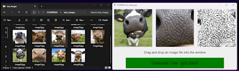
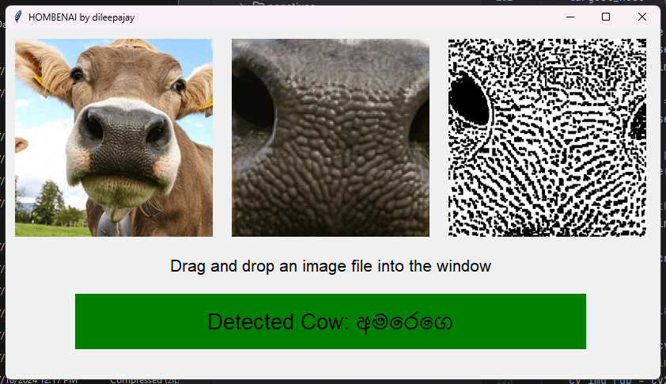
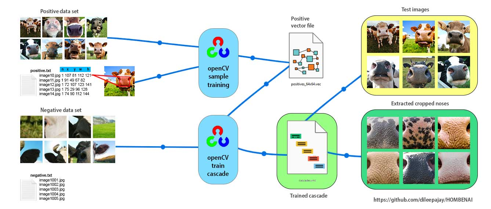
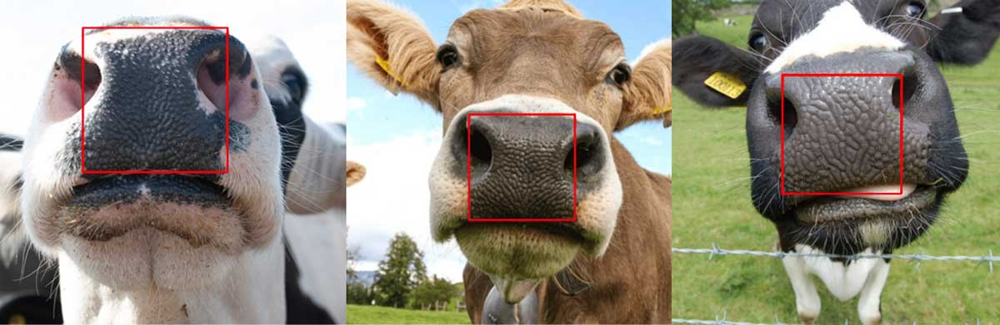
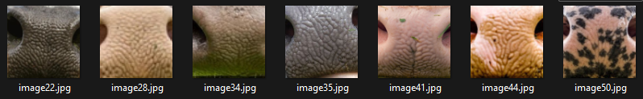
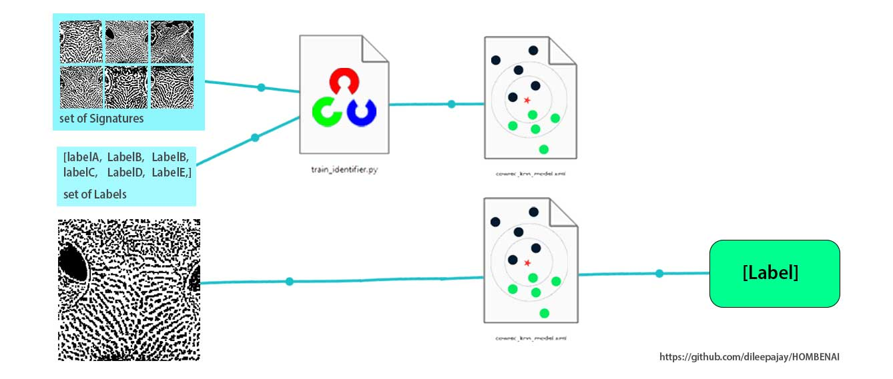
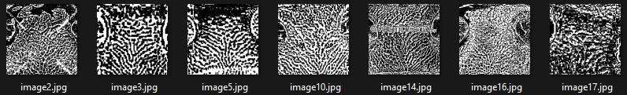

# Cow Identity Recognition by Nose-Prints


 
This project provides a comprehensive approach to identifying cows by their unique nose-prints. The goal is to develop a reliable system that can recognize individual cows based on the distinctive patterns found on their noses. This method can be highly beneficial for livestock management, ensuring accurate identification without the need for invasive or stressful methods.

<table>
<tr>
<td>



</td>
<td>

## Key Features

- **Image Preprocessing**: The project includes scripts to preprocess images by resizing, grayscale conversion, adaptive thresholding, and morphological operations to highlight nose patterns.
- **Annotation**: Tools to manually annotate images to mark the nose areas, creating a dataset for training.
- **Rescaling**: Automated scripts to rescale images and annotations to multiple sizes, facilitating robust training.
- **Negative Sample Preparation**: Guides to prepare and resize negative samples to improve the model's ability to distinguish noses from other parts of the cow or background.
- **Cascade Classifier Training**: Steps to train a Haar cascade classifier using positive and negative samples, tailored to detect cow noses.
- **Nose Extraction**: Tools to use the trained classifier to extract nose regions from images.
- **Nose-Print Processing**: Scripts to process extracted noses into high-contrast prints suitable for recognition.
- **Identifier Training**: Training an identifier model using KNN or CNN algorithms to recognize individual cows from their nose prints.
- **GUI Application**: A user-friendly graphical interface for testing the system by dragging and dropping test images to see the identification results.

</td>
</tr>
</table>


## Current Status

This project is currently in the research and prototype stage. It is not yet intended for industrial use. The current focus is on developing and refining the algorithms and methods to ensure accurate and reliable cow identification. Contributions and feedback are welcome to help improve the system.

---

# Cascade Classifier Training for Detect Cow Noses
In this project, we trained a Haar cascade classifier to identify the nose print from a clear cow face. (follow stage 1-8) The classifier was trained using 50 cow face images as positive samples and 1500 non-nose images as negative samples. The trained cascade classifier can be used to detect the nose area in cow face images accurately.


Process of training and using an OpenCV Haar cascade classifier for cow nose recognition. It starts with the preparation of positive and negative data sets. The positive data set includes annotated cow face images, while the negative set contains images without cow noses. These are listed in `positive.txt` and `negative.txt` respectively. Using OpenCV, a positive vector file is created from the annotated data, and the cascade classifier is trained using this vector file and the negative images, resulting in `cascade.xml`. This trained classifier is then used to detect and extract nose regions from test images, producing high-contrast nose prints for further recognition tasks. The diagram visually connects each step from data preparation to nose print extraction.




The trained classifier is saved as `cascade.xml` and can be used in various scripts for nose detection. You can download the trained `cascade.xml` file from the following link:

[Download cascade.xml](https://your-download-link-here)

---

## Nose Extraction

In this project, we utilize the trained cascade classifier (`cascade.xml`) to extract nose regions from cow face images. The classifier accurately detects the nose area in a given image, allowing us to isolate this region for further processing.



The process involves:
1. **Loading the trained cascade classifier**: Using OpenCV to load `cascade.xml`.
2. **Detecting the nose region**: Applying the classifier to the cow face images to locate the nose.
3. **Cropping the detected nose region**: Extracting the nose area from the image based on the detected coordinates.

This is implemented in the `script_extract/nose_extract.py` script. The extracted nose images are saved in the `noses/` directory.


# Cow Nose Identifier Training
In this project, we employ machine learning techniques to recognize individual cows based on their unique nose prints. The two primary algorithms considered for this task are K-Nearest Neighbors (KNN) and Convolutional Neural Networks (CNN).



The image illustrates the process of training and using a K-Nearest Neighbors (KNN) model for cow nose print recognition. It begins with a set of high-contrast nose print images (signatures) and their corresponding labels, representing cow identities. These data are used to train the KNN model via the train_identifier.py script, resulting in the trained model (cowrec_knn_model.xml) and a label dictionary (label_dict.npy). The trained model can then predict the identity of a new nose print by finding the closest matches among the trained signatures and assigning the most common label. This prediction process enables accurate cow identification based on their unique nose prints.

---

## Nose-Print Processing

After extracting the nose regions, we process these images to create high-contrast nose prints suitable for recognition. This step enhances the unique patterns on the nose, making them more distinguishable for the recognition model.



The process involves:
1. **Grayscale conversion**: Converting the extracted nose images to grayscale to simplify the image data.
2. **Adaptive thresholding**: Applying adaptive thresholding to highlight the unique patterns on the nose.
3. **Morphological operations**: Using morphological operations to further enhance the patterns and remove noise.

This is implemented in the `script_extract/node_to_print.py` script. The processed nose prints are saved in the `noseprint/` directory.

By enhancing the nose prints, we ensure that the recognition model can effectively differentiate between individual cows based on their unique nose patterns.

--- 

## K-Nearest Neighbors (KNN)

KNN is a simple and effective algorithm for classification, especially suited for small datasets. It works by comparing the features of a new data point to the features of the training data points and assigning the most common label among the nearest neighbors.

- **Advantages of KNN**:
  - **Simplicity**: Easy to understand and implement.
  - **Effective for Small Datasets**: Performs well with limited data.
  - **No Training Phase**: KNN is a lazy learner, meaning it doesn't require a training phase, which can be advantageous for smaller datasets.

- **Usage in this Project**:
  - We use KNN due to our limited dataset of cow nose prints.
  - The model is trained using features extracted from the nose prints, and the trained KNN classifier can identify individual cows based on these features.

The implementation of KNN for nose print recognition is provided in the `script_identifier/train_identifier.py` script.

## Convolutional Neural Networks (CNN)

CNNs are a class of deep neural networks commonly used for analyzing visual imagery. They are particularly powerful for large datasets and complex image recognition tasks, such as fingerprint detection.

- **Advantages of CNN**:
  - **High Accuracy**: Capable of capturing complex patterns and details in images.
  - **Scalability**: Performs better with larger datasets and can be scaled up easily.
  - **Robustness**: Handles variations in image data effectively, making it ideal for tasks like fingerprint and face recognition.

- **Usage for Better Results**:
  - If you have access to a larger dataset of cow nose prints, using CNN can significantly improve recognition accuracy.
  - CNNs have been successfully used in fingerprint detection and other biometric recognition systems, making them a suitable choice for more extensive and detailed nose print datasets.

For those interested in implementing a CNN-based approach for better results, you can explore frameworks like TensorFlow or PyTorch to build and train your models.

## Conclusion

While KNN is an excellent choice for this project due to the small dataset, exploring CNNs can lead to more accurate and robust models if you have access to larger datasets. The current implementation provides a foundation that can be scaled and improved upon with more data and advanced algorithms.

---
 
 

# Installation

1. **Install Python**:
    - Download and install the latest version of Python from [python.org](https://www.python.org/downloads/).
    - Add Python and the Scripts folder to your environment variable `PATH`.

    Example for Windows:
    ```
    C:\Python39;
    C:\Python39\Scripts;
    ```

2. **Install OpenCV**:
    - Download OpenCV  [opencv-3.4.11-vc14_vc15.exe](https://sourceforge.net/projects/opencvlibrary/files/3.4.11/opencv-3.4.11-vc14_vc15.exe/download). This version have pre-builds. 
    - Run the installer and extract the files.
    - Locate the `bin` directory in the extracted files and add it to your environment variable `PATH`.

    Example for Windows:
    ```
    C:\opencv\build\x64\vc15\bin;
    ```

3. **Install Python Dependencies**:
    - Navigate to the project directory and install the required Python packages using the `requirements.txt` file.

    ```bash
    pip install -r requirements.txt
    ```

4. **Run the Project**:
    - You can use the command prompt to run the scripts, or you can use an IDE like PyCharm, VSCode, or any Python-compatible IDE to run the project.

    Example command to run a script:
    ```bash
    python script_name.py
    ```

Replace `script_name.py` with the name of the script you want to run.

## Stages

### Stage 1: Positive Image Samples Preparation

Convert all positive images to a resolution of 1024x1024.

```bash
python download_image_resize.py
```

This script resizes all images in the `positives/` directory and saves them to `positives/1024x1024`.

### Stage 2: Annotate Images

Mark the nose area in all images and create `positives_1024x1024.txt` with image paths and nose coordinates.

```bash
opencv_annotation --annotations=positives_1024x1024.txt --images=positives/1024x1024
```

### Stage 3: Rescale Positive Images

Rescale images and annotations to 512, 256, 128, and 64 sizes.

```bash
python script_cascade/positive_images_resize.py
```

### Stage 4: Prepare Negative Samples

Add samples to the `negatives/` folder. Ensure there are at least twice as many negatives as positives. Then, resize negative images and create `negative.txt`.

```bash
python script_cascade/negative_images_resize.py
python script_cascade/script_create_negative_txt.py
```

### Stage 5: Train Cascade Classifier

Create a vector file and train the cascade classifier.

```bash
opencv_createsamples -info positives_64x64.txt -num 50 -w 24 -h 24 -vec positives_64x64.vec
opencv_traincascade -data script_cascade/output/64 -vec positives_64x64.vec -bg negatives.txt -numPos 50 -numNeg 1600 -numStages 10 -w 24 -h 24 -precalcValBufSize 2048 -precalcIdxBufSize 2048
```

### Stage 6: Test Cascade Classifier

Test the trained cascade classifier.

```bash
python script_cascade/cascade_test.py
python script_cascade/cascade_test_loop.py
```

### Stage 7: Debug and Retrain

If the recognizer misclassifies, add those images to the negatives and retrain from Stage 4.

```bash
python script_cascade/castcade_debug.py
```

### Stage 8: Extract Noses

Use the trained classifier to extract noses from images.

```bash
python script_extract/nose_extract.py
```

### Stage 9: Process Nose-Prints

Grayscale and apply adaptive thresholding to nose-prints.

```bash
python script_extract/node_to_print.py
```

### Stage 10: Train Identifier Model

Train an identifier model using the KNN algorithm (or CNN for better results).

```bash
python script_identifier/train_identifier.py
```

### Stage 11: Test the Model

Test the trained identifier model.

```bash
python script_identifier/model_test.py
```

### Stage 12: Run the App

Run the UI application to test the model. Drag and drop test images to see the labels.

```bash
python app/HOMBENAI.py
```

## Acknowledgements

Thanks to the researchers and authors of the paper "[Cattle identification: the history of nose prints approach in brief](https://www.researchgate.net/publication/347434374_Cattle_identification_the_history_of_nose_prints_approach_in_brief)" for their valuable work and contributions to this field.

## Notes

- Make sure to install all necessary dependencies before running the scripts.
- The model's accuracy can be improved by using a larger dataset and fine-tuning the parameters.

## License

This project is licensed under the MIT License.
